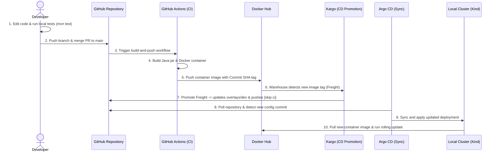

# Java Hello World Container & GitOps

This repository contains a simple Java Hello World service, packaged as a container, and structured for GitOps deployment using Kustomize, GitHub Actions, ArgoCD, and Kargo.

## Repository Structure

```
.
├── .github/
│   └── workflows/
│       └── build-and-push.yaml    # GitHub Actions CI/CD pipeline
├── gitops/
│   ├── base/
│   │   ├── deployment.yaml        # Common Kubernetes Deployment manifest
│   │   └── kustomization.yaml     # Kustomize base configuration
│   └── overlays/
│       └── dev/
│           └── kustomization.yaml # Development overlay patching the image tag
├── kargo/                         # Kargo promotion engine configuration
│   ├── git-credentials.yaml       # GitHub write access credentials (ignored by git)
│   ├── project.yaml               # Kargo Project declaration
│   ├── warehouse.yaml             # Kargo Warehouse watching Docker Hub
│   └── stage-dev.yaml             # Kargo Stage defining dev promotion workflow
├── src/
│   ├── main/
│   │   └── java/
│   │       └── com/
│   │           └── example/
│   │               └── HelloWorldApp.java # Java hello world logger
│   └── test/
│       └── java/
│           └── com/
│               └── example/
│                   └── HelloWorldAppTest.java # Unit tests

├── docs/
│   └── Plan.md                    # Master implementation plan
├── .dockerignore                  # Files excluded from Docker builds
├── Dockerfile                     # Multi-stage Docker build file
├── pom.xml                        # Maven dependency and build manifest
└── README.md                      # Quickstart documentation
```

---

## Local Development & Testing

### 1. Compile, Test, & Build Locally (Requires Java 17 + Maven)
Run unit tests:
```bash
mvn test
```

Build and run application:
```bash
mvn clean package
java -jar target/java-hello-world-1.0-SNAPSHOT.jar
```


### 2. Run with Docker (Requires Docker)
Build the image:
```bash
docker build -t myusername/java-hello-world .
```

Run the container:
```bash
docker run --env INTERVAL_SECONDS=5 myusername/java-hello-world
```

### 3. View Cluster Logs (Kubernetes)
To view the output of the application running in the development namespace (`dev`) on the local Kind cluster:

* **Fetch all logs for the deployment:**
  ```bash
  kubectl logs deployment/java-hello-world-container -n dev
  ```
* **Stream logs in real-time (Follow):**
  ```bash
  kubectl logs -f deployment/java-hello-world-container -n dev
  ```

---

## GitHub Actions Secret Configuration

To enable the GitHub Actions pipeline, configure the following secrets in your repository settings (`Settings` > `Secrets and variables` > `Actions`):
- `DOCKER_USERNAME`: Your DockerHub username.
- `DOCKER_PASSWORD`: Your DockerHub personal access token (or password).

Also, ensure that under `Settings` > `Actions` > `General` > `Workflow permissions`, you select **"Read and write permissions"** so the workflow can push the updated Kustomize tags back to the repository.

---

## CI/CD and GitOps Workflow Sequence

Below is the step-by-step lifecycle of a code change, showing how it goes from local testing to automated production rollout via Kargo and Argo CD (GitOps):



### Detailed Sequence of Events:
1. **Local Development & Verification:**
   * The developer modifies files (e.g., updates Java code or edits Kubernetes configuration templates).
   * The developer runs local verification:
     ```bash
     mvn test
     ```
2. **Version Control Integration:**
   * Once tests pass, the developer stages, commits, and pushes the code changes to a feature branch.
   * A Pull Request (PR) is opened to merge the changes into the `main` branch.
3. **Triggering CI (Build & Push):**
   * When the PR is approved and merged into `main`, GitHub Actions detects the push.
   * It triggers the CI workflow in `.github/workflows/build-and-push.yaml` (since it contains changes outside ignored paths like `gitops/**`, `kargo/**`, etc.).
4. **Automated Build & Registry Push:**
   * The runner compiles the code, builds the Docker container, logs into Docker Hub, and pushes the image with tags `latest` and `[commit-sha]`.
5. **Kargo Freight Discovery:**
   * Kargo's `Warehouse` resource constantly polls Docker Hub for new tags matching a 40-character commit SHA pattern.
   * Upon discovering the new tag, the Warehouse packages it as a new **Freight** artifact in the cluster.
6. **GitOps Promotion (CD):**
   * The Freight is promoted to the `dev` stage (either automatically or manually via Kargo CLI/Dashboard).
   * Kargo executes the promotion template: it clones the repository, runs Kustomize to update the target image tag in `gitops/overlays/dev/kustomization.yaml` to the new Git Commit SHA, commits the changes with `[skip ci]`, and pushes them back to `main` using your Git Credentials Secret.
7. **Argo CD Sync:**
   * Argo CD continuously monitors the repository's `gitops/` directory.
   * Upon detecting Kargo's commit, Argo CD automatically syncs the manifests.
8. **Cluster Rolling Update:**
   * Argo CD applies the new deployment configuration to the Kind cluster.
   * The cluster pulls the newly pushed image from Docker Hub and executes a rolling update to roll out the service update without downtime.

---

## Setting up the Local Dev Environment

Refer to [Plan.md](file:///home/tonyh/_Projects/java-hello-world-container/docs/Plan.md) for the master implementation plan. Below are the key steps and commands to set up the local cluster and Argo CD.

### 1. Provision the Kind Cluster
Ensure Docker is running (if using WSL2, ensure Docker Desktop is started or the Docker daemon is active).
```bash
kind create cluster --config kind-config.yaml --name dev-cluster
```

### 2. Install Argo CD
Create the namespace and apply the Argo CD manifests:
```bash
kubectl create namespace argocd
kubectl apply --server-side --force-conflicts -n argocd -f https://raw.githubusercontent.com/argoproj/argo-cd/stable/manifests/install.yaml
```

### 3. Install Kargo
Kargo requires `cert-manager` for its admission webhooks. 

First, install `cert-manager`:
```bash
kubectl apply -f https://github.com/cert-manager/cert-manager/releases/download/v1.15.1/cert-manager.yaml
```

Next, generate the required admin credentials (requires `apache2-utils` to run `htpasswd`) and install Kargo using Helm:
```bash
# Generate keys
PASS=$(openssl rand -base64 48 | tr -d "=+/" | head -c 32)
HASHED_PASS=$(htpasswd -bnBC 10 "" $PASS | tr -d ':\n')
SIGNING_KEY=$(openssl rand -base64 48 | tr -d "=+/" | head -c 32)

echo "Save your admin password: $PASS"

# Install Kargo
helm upgrade --install kargo oci://ghcr.io/akuity/kargo-charts/kargo \
  --namespace kargo \
  --create-namespace \
  --set api.adminAccount.passwordHash=$HASHED_PASS \
  --set api.adminAccount.tokenSigningKey=$SIGNING_KEY \
  --wait
```

### 4. Accessing the Dashboards (UIs)

#### Argo CD Dashboard
1. **Port-Forward the service:**
   ```bash
   kubectl port-forward svc/argocd-server -n argocd 8080:443
   ```
2. **Access URL:** Open **`https://localhost:8080`** in your browser (bypass the self-signed certificate warning).
3. **Credentials:**
   * **Username:** `admin`
   * **Password:** Retrieve the default admin password:
     ```bash
     kubectl -n argocd get secret argocd-initial-admin-secret -o jsonpath="{.data.password}" | base64 -d
     ```

#### Kargo Dashboard
* **Option A (CLI):** If you have the Kargo CLI installed, simply run:
  ```bash
  kargo dashboard
  ```
* **Option B (Manual Port-Forward):**
  1. Port-forward the API service:
     ```bash
     kubectl port-forward svc/kargo-api -n kargo 8081:443
     ```
  2. Access **`https://localhost:8081`** in your browser.
  3. Log in using the admin password generated during the Helm installation step above.

#### Why use `--server-side` and `--force-conflicts`?
* **`--server-side`**: Argo CD includes the `applicationsets.argoproj.io` CustomResourceDefinition (CRD) which is extremely large. A default client-side apply will attempt to store the entire definition in the `kubectl.kubernetes.io/last-applied-configuration` annotation. Since Kubernetes limits annotation size to 256 KB (262,144 bytes), this causes client-side apply to fail. Using Server-Side Apply (SSA) bypasses this limit by tracking state on the API server.
* **`--force-conflicts`**: If any resources were previously applied using client-side apply, the API server will flag field ownership conflicts. Adding `--force-conflicts` resolves these by allowing Server-Side Apply to take over ownership of the fields.

### WSL2 Considerations
* **Docker Daemon Connection:** Ensure WSL2 integration is enabled in your Docker Desktop settings under **Settings > Resources > WSL integration**.
* **DNS Resolution Issues:** If you encounter network lookup errors such as `dial tcp: lookup raw.githubusercontent. ...: no such host`, it means WSL2 has lost its connection to DNS. You can resolve this by restarting the WSL environment (run `wsl --shutdown` in Windows PowerShell/CMD, then restart your terminal) or verifying your `/etc/resolv.conf` settings.
